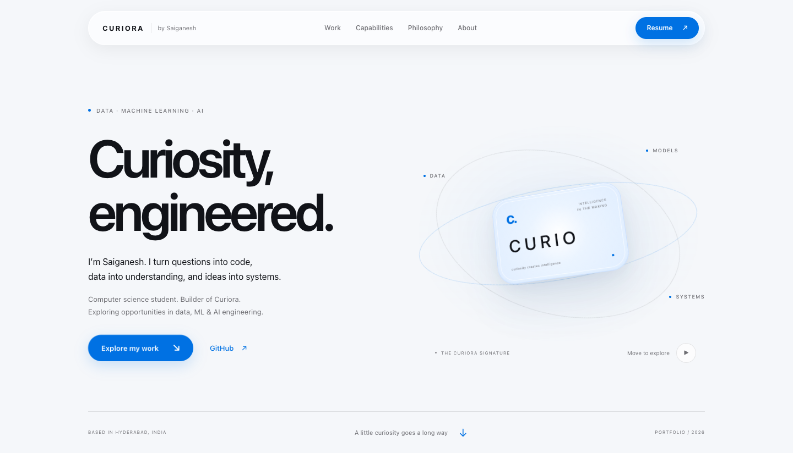

# Saiganesh Sattenapalli — Curiora Portfolio

A personal portfolio exploring Python backend systems, applied AI, data, and machine learning. Built with **FastAPI, Jinja2, and vanilla HTML/CSS/JavaScript**.

[GitHub profile](https://github.com/saiganeshsattenapalli) · [Resume PDF](static/downloads/saiganesh-sattenapalli-resume.pdf) · [Project evidence](docs/resume-evidence.md)



## Run locally

Use Python 3.10 or newer:

```sh
python3 -m venv .venv
source .venv/bin/activate
python -m pip install -r requirements.txt
python -m uvicorn main:app --reload
```

Open http://127.0.0.1:8000. The application entry point is the root `main.py`.

## Curiora visual system

Campus is the palette authority: white, near-white, neutral text, **Azure #0071E3**, system typography, and translucent glass with `blur(28px) saturate(180%)`.

The CSS loads in a deliberate order:

| Layer | Responsibility |
| --- | --- |
| `static/css/design-system.css` | The single source of token values: colors, materials, type, radii, shadows, easing |
| `static/css/base.css` | Reset, global typography, page utilities, focus and reduced-motion behavior |
| `static/css/components.css` | Liquid-glass navbar, buttons, links, shared hover and press states |
| `static/css/animations.css` | Scroll reveals and the two signature orbit animations |
| `static/css/portfolio.css` | Portfolio section layouts and token-based materials |

The navbar follows Campus’s slim 52px height and 1100px maximum width. Action links use Azure primary buttons and glass secondary buttons.

The Curio signature is a simple glass capsule with a pointer-positioned highlight and bounded 3D tilt. An eight-second floating cycle, synchronized soft ground shadow, and slow ambient breathing give it a quiet sense of depth; the detailed card labels and inset frame have been removed. Campus supplies the 12s/16s orbit rhythm; the Curiora Design System supplies button/card lift; Research informs navigation feedback; the birthday project informs short reveal staggering and arrow feedback. These patterns are adapted into the portfolio, with no personal birthday content or media included. See the [source comparison](docs/curiora-consistency.md).

There is no Three.js, GSAP, particle system, external font request, or frontend framework. JavaScript schedules pointer updates only when input changes. Signature motion pauses when offscreen, when the document is hidden, when manually paused, or when reduced motion is requested. Touch devices retain the static material without pointer tilt.

## Content and evidence

`data/projects.json` is the authoritative project dataset. FastAPI supplies it to the Jinja macros and the inline JSON consumed by project dialogs. `/projects` exposes the same records. `data/research.json` supplies the `/research` endpoint and research references. See [content schema](docs/content-schema.md).

The main Curio story identifies **GPT-OSS 20B for text** and **Qwen3-VL 8B for vision/multimodal input**, as pretrained model integrations.

Implemented architecture:

> Input → Validation → Modality routing → Model gateway → Runtime → Inference → Response / cleanup

Product direction:

> Perceive → Understand → Route → Act → Verify

Act and Verify remain product direction, not claims of completed capabilities. Project descriptions distinguish working code, experiments, limitations, and planned features. The portfolio itself does not run model inference or require model downloads.

`/resume` serves the existing PDF; its layout was not changed in this visual consistency update. Resume download and GitHub links remain available in the site.

## Checks

```sh
python -m pip install -r requirements-dev.txt
python -m unittest discover -s tests
```

For browser checks, install Playwright in a separate development environment and have Google Chrome installed. Start the app on port 8765, then run:

```sh
node tests/browser_content.cjs
node tests/browser_design.cjs
```

Set `PLAYWRIGHT_MODULE` to an installed Playwright module path if it is outside the local Node resolution path. Set `PORTFOLIO_URL` to test another local or deployed URL. The tests launch an isolated headless Chrome profile and check project data, dialogs, keyboard behavior, filters, resume delivery, visual tokens, signature interactions, reduced motion, and responsive overflow. Current screenshots and computed-style results are in `docs/previews/current/`.

## Deployment

A native FastAPI [Render Blueprint](render.yaml) is included:

[Deploy to Render](https://render.com/deploy?repo=https://github.com/saiganeshsattenapalli/My-Portfolio)

Import the repository into your Render account and review the free web service configuration. The build command is `pip install -r requirements.txt`; the start command is `uvicorn main:app --host 0.0.0.0 --port $PORT`. No application secrets or database are required. Automatic redeployment is disabled in the blueprint so later commits can be reviewed before a manual deploy.

This follows [Render's FastAPI deployment instructions](https://render.com/docs/deploy-fastapi). Free instances have [free-tier limitations](https://render.com/docs/free), including idle spin-down. The blueprint is deployment-ready configuration; it is not evidence that a live service exists. No live deployment URL has been verified yet.
