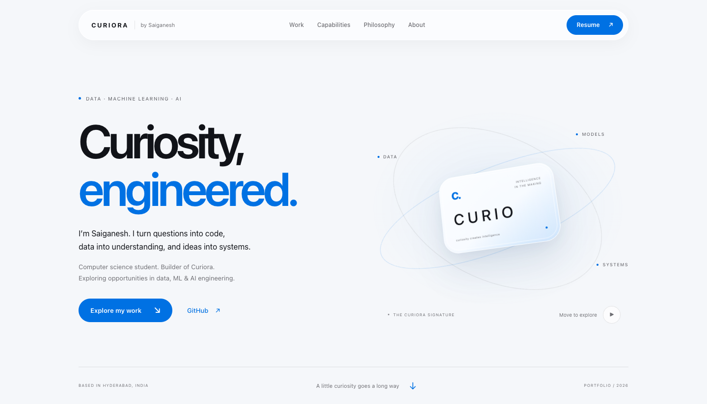
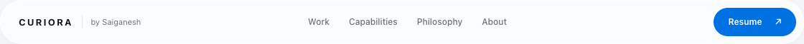
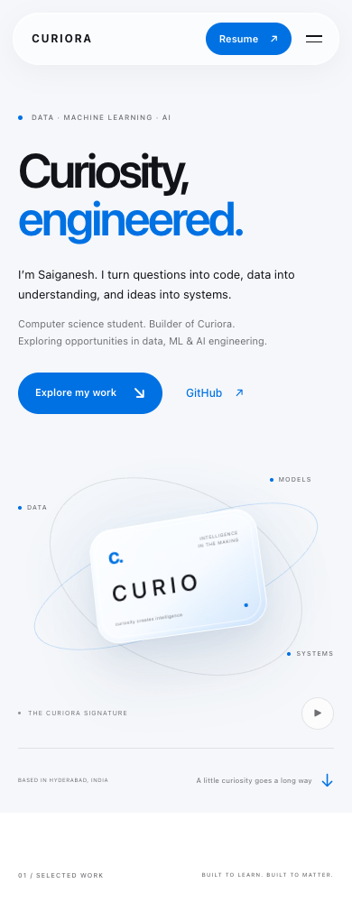

# Phase 2 — Curiora design foundation

Historical first-pass record. Superseded by [the source-based consistency review](curiora-consistency.md) and `previews/current/`.

Implementation is ready for visual review. Chrome validation is complete; actual Safari validation is pending permission. Phase 3 has not started.

## Scope

Restored the Curiora white / near-white / Azure environment and system typography. Kept the existing Curio + DATA / MODELS / SYSTEMS composition and hero wording. Replaced the WebGL renderer with two fine CSS ellipses and a frosted glass core, with restrained pointer tilt. The floating navbar uses the shared glass tokens, centered navigation, Curiora identity, and an Azure Resume action.

Existing later-section geometry remains in portfolio.css, with its old colors and font declarations migrated to canonical tokens. No later-section HTML or content was rebuilt. Hash checks confirmed canonical JSON, main.py, content JavaScript, the resume builder, and resume downloads are unchanged.

## Exact changed and added files

Paths below are relative to the Portfolio repository.

Modified:
- static/css/design-system.css — preserved canonical tokens; added named neutral / Azure materials and glass shadows.
- static/css/base.css — reset, system typography, page environment, layout utilities, accessibility, reduced motion.
- static/css/components.css — floating navigation, mobile navigation, buttons, reusable glass surfaces.
- static/css/animations.css — reveal behavior and the two restrained signature ellipse animations.
- static/css/portfolio.css — section-specific styles consuming shared tokens; rebuilt current hero materials; preserved later-section geometry.
- templates/index.html — connected all five stylesheets, replaced navbar markup, removed the signature canvas, retained hero composition and copy.
- static/js/signature.js — input-driven pointer tilt, pause/play, reduced-motion preference, offscreen/background pause; no graphics library or continuous JavaScript render loop.
- static/js/navigation.js — toggles the scrolled glass state using the existing scroll scheduler.
- static/assets/favicon.svg — near-white / Azure identity.

Added:
- tests/browser_design.cjs — browser checks for canonical layers/materials, signature motion, responsiveness, and navigation.
- docs/phase2-design-foundation.md — this review record.
- docs/previews/phase2/hero-chrome.png — 1440px desktop Chrome hero capture.
- docs/previews/phase2/navbar-chrome.png — desktop navbar detail.
- docs/previews/phase2/mobile-chrome.png — 390px Chrome capture.
- docs/previews/phase2/chrome-verification.json — actual computed styles, Chrome version, and check results.

## Final token system

The sole source of visual token values is static/css/design-system.css. Stylesheets consume it in this order: design-system → base → components → animations → portfolio. portfolio.css defines neither a root palette nor literal color values.

| Token | Value |
| --- | --- |
| --color-background | #ffffff |
| --color-surface | #f5f5f7 |
| --color-text | #111318 |
| --color-text-secondary | #6e6e73 |
| --color-text-tertiary | #929297 |
| --color-accent | #0071E3 |
| --color-accent-hover | #0077ED |
| --color-environment | #F5F7FA |
| --glass-bg | rgba(255,255,255,0.68) |
| --glass-bg-scrolled | rgba(255,255,255,0.88) |
| --glass-filter | blur(28px) saturate(180%) |
| --max-width | 1120px |

Typography: `-apple-system, BlinkMacSystemFont, "SF Pro Display", "SF Pro Text", "Helvetica Neue", Arial, sans-serif`.

Supporting material tokens use neutral borders, silver, white highlights, and Azure at 6%, 10%, and 19% opacity. Shared radii are 14 / 20 / 32 / 42px and pill; shared durations are 180 / 300 / 500ms. The original legacy `serif-word` class remains in unchanged content markup but now uses normal system typography.

## Verification

- Seven Python content tests pass.
- Existing Chrome content regression passes: canonical JSON/API equality, four project card/dialog pairs, model visibility, architecture status, links, filters, Escape/focus, responsive dialogs, resume response, and no JavaScript errors or local 404s.
- Desktop Google Chrome 152.0.7977.83, headless isolated test profile, 1440 × 1000 viewport: canonical computed colors, glass, system font, all five CSS layers, 1120px navbar, no canvas or undefined token references.
- Signature pointer tilt and keyboard pause/play pass. Reduced motion disables animation. Background/offscreen pause is implemented through visibility and intersection events.
- No horizontal overflow at 1440, 1024, 768, 600, 390, and 320px. Mobile menu and Escape behavior pass.
- Hero and mobile screenshots visually inspected; no green or decorative serif remains in active CSS.
- git diff --check passes.

Safari: NOT VERIFIED. Automatic approval review rejected connecting to Safari because its current UI could expose unrelated private session content. No Safari screenshot is provided, and Chrome results are not presented as Safari results. User approval for accessing Safari's current window is needed to complete that check.

## Visual review images

